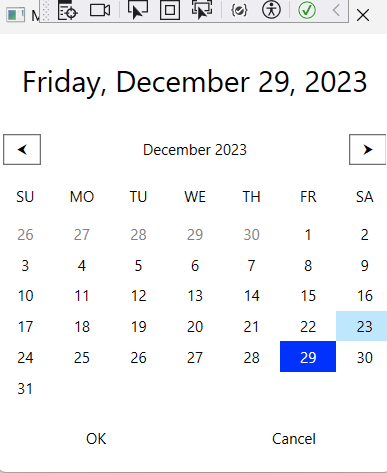
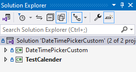
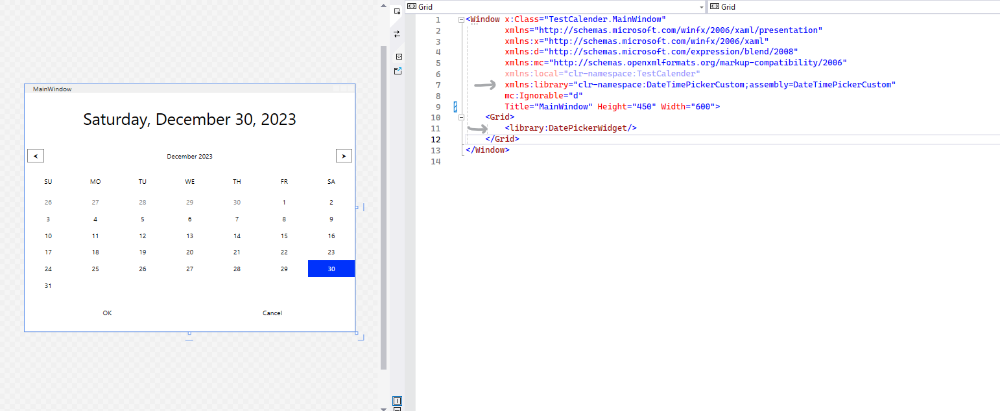

# DateTimePickerCustom

This projects contains a LibraryClass for a C# WPF application project. The library implements a DateTiemPicker, which besides the date picking has along side a time picking widgets.  
Extented documenetations and comments for easy modifications and styling. Appropriate for a dropdown or popup widget for returning a DateTiem value to a textbox, or for a stand-alone calander widget.

## Table of Contents

- [DateTimePickerCustom](#datetimepickercustom)
  - [Table of Contents](#table-of-contents)
  - [Features](#features)
  - [Installation](#installation)
    - [Method 1. NuGet](#method-1-nuget)
    - [Method 2. GitHub](#method-2-github)
  - [Usage](#usage)
  - [Contributing](#contributing)
  - [License](#license)

## Features

1. LibraryClass for a DatePicker. All the logic is located in teh code behind, which is heavily commneted for easy understanding and modification.
2. Therefore, the .xaml file is clean and contains only the styles (which will be moved in a different file in the next update) and the grid layout.
3. A time picker will be added soon.
4. The project solution has a WPF application connected to the library for testing the LibraryClass.

**The DatePicker widget (the TimePicker will be added to the next update).**

## Installation

### Method 1. NuGet

1. Download using Nuget Package manager.
2. In the Solution Manager, under dependancies there should be a *DateTimePickerCustom.dll* file.
3. Include that file in your WPF Application by using the following line.

*xmlns:[YourNamespace]="clr-namespace:DateTimePickerCustom;assembly=DateTimePickerCustom"*

### Method 2. GitHub

1. Clone Github repository and add the LibraryClass to your solution.
2. This is how the solution tree in the solution explorer should look like, if you add a test WPF application.

3. Importing the LbraryClass to the WPF aaplication using the lines with the gray arrow.

## Usage

Besides a stand-alone calander, its a great and stylized solution for a Date and Time Picker as a Popup for a TextBlock.

## Contributing

If you would like to contribute to the project, I would love hearing from you. I message in github or in my e-mail.

## License

MIT-license

---

